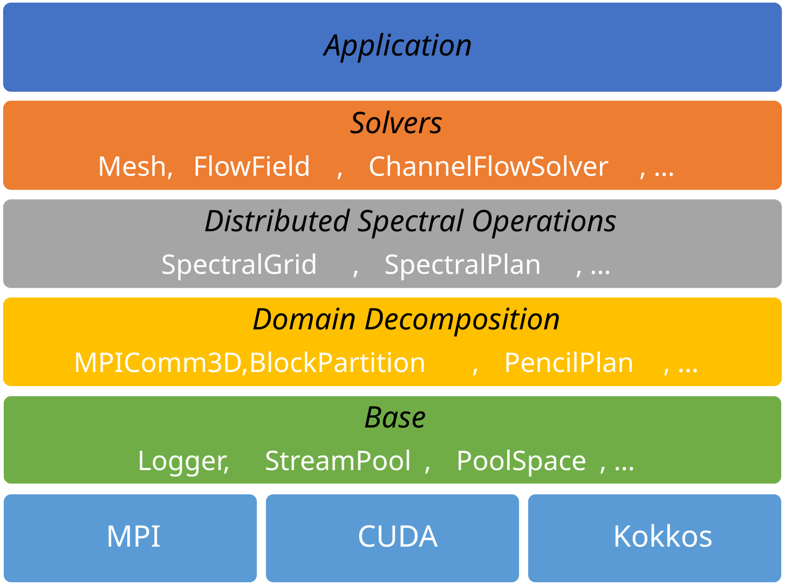

# Overview

## High-level architecture

The computation framework utilizes [Kokkos performance portable programming model](https://kokkos.org/), a C++ abstraction layer providing a unified interface for various parallelization backends, such as CUDA, HIP, SYCL, and OpenMP. By default, the code uses the OpenMP as the host backend for CPU-based thread parallelism, which is enabled by default. For execution on NVIDIA GPUs, the CUDA backend may be enabled at compile time.

> __Note__  Currently, some mechanisms of the code, such as the asynchronicity, uses CUDA API directly. As a result, the code cannot directly run GPUs from vendors other than NVIDIA.

For distributed parallelism, the code supports slab decomposition (1D decomposition), which is applied in the vertical direction, or pencil decomposition (2D decomposition), which is applied in one of the horizontal directions and the vertical direction (pencil decomposition is not extensively tested). The code uses MPI for communication between processes. When running on GPUs, each MPI process should be assigned to a single GPU device. When running on CPUs only, one can use fewer MPI processes than the number of CPU cores, and use OpenMP threads to parallelize within each MPI process.

The code consists of several layers as shown below:

- __Parallelization layer__: Backends, such as Kokkos, MPI and CUDA.

- [__Base layer__](base.md): provides common utilities for the program, such as logging, asynchronicity, memory management, wrappers for MPI and Kokkos, and interfaces for configuration file handling.

- [__Domain decomposition layer__](decomp.md): provides the objects for describing the domain decomposition, as well as the functions for performing the transposition and halo exchange of data between MPI processes.

- [__Distributed spectral operation layer__](spectral.md): provides the data structures and algorithms for computing the spectral transforms and operations, such as the forward and backward Fourier transforms and the differentiation operations.

- [__Solver layer__](solver/overview.md): contains the data structures and algorithms for solving the governing equations, such as the structures for storing the computational mesh, flow variables, and the routines for computing the fluxes and updating the flow variables.

- __Application layer__: contains the main program and the driver program, typically responsible for reading the command line options and configuration files, and calling the initialization and time stepping routines. The user may also extend the application layer by plugging in their own application code to underlying layers.

